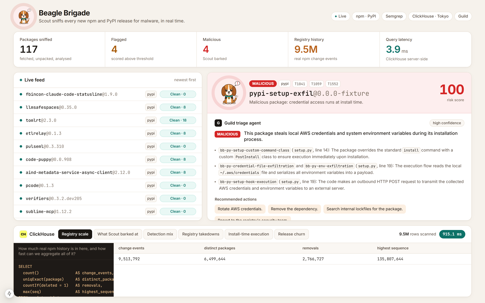
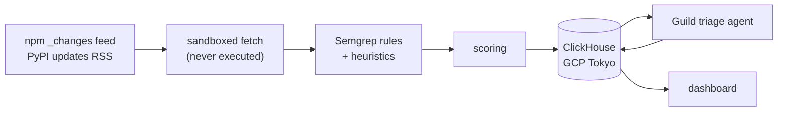
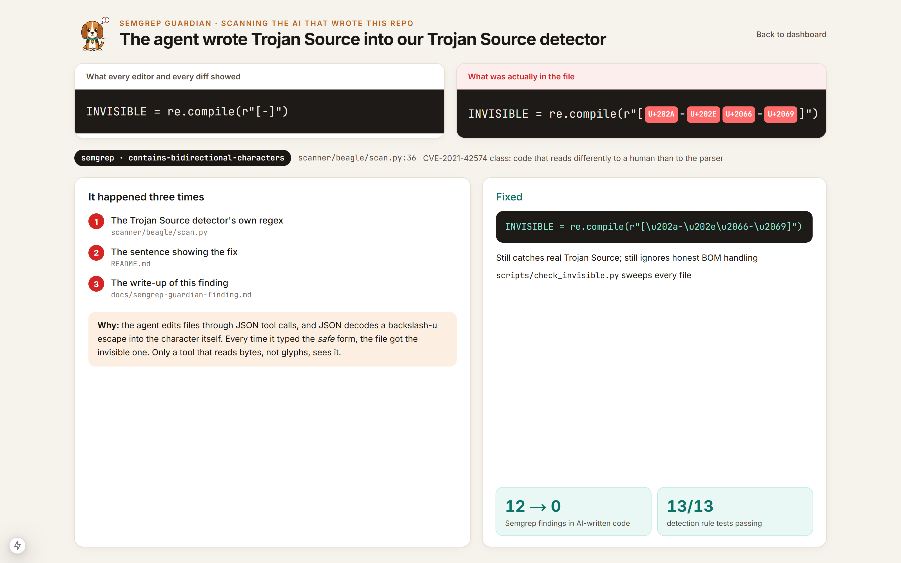

# Beagle Brigade

Real-time malware detection for new npm and PyPI releases.

Attackers regularly publish malicious versions of npm and PyPI packages,
usually with a stolen maintainer token. Install scripts run that code on every
developer machine and CI runner that installs the package, before anyone
reviews it. Beagle Brigade watches both registries, downloads each new release
into a sandbox within seconds, analyses it with Semgrep dataflow rules without
executing it, and sends anything suspicious to an AI triage agent that returns
a verdict and recommended actions.

The project is defensive. It only reads public registry data and never runs
the code it downloads.



**Demo video:** _YOUTUBE_LINK_HERE_

---

## Results

| Metric | Value |
|---|---|
| Real npm and PyPI releases scanned live during the hackathon | 184 |
| False alarms on those live releases | 0 |
| Malware test fixtures detected | 4 of 4 (score 100) |
| Benign native-build fixture | score 13 (clean) |
| npm registry events stored in ClickHouse | 9.5M |
| Semgrep findings in this repository | 12 found, 0 open |

---

## Sponsors

| Sponsor | How we used it | Result |
|---|---|---|
| ClickHouse | The only datastore: scan results, findings, detections and replicated npm registry history | 9.5M rows, loaded at ~49k rows/sec; full-table aggregates under 1 second, dashboard queries in single-digit milliseconds |
| Semgrep | Detection engine (custom taint rules), and Semgrep Guardian on the AI-written code in this repo | 13/13 rule tests passing; tuned on live traffic to 0 false alarms; 12 repo findings resolved, including Trojan Source characters in AI-written code |
| Guild.ai | Hosts the triage agent that reviews each detection | Verdict, reasoning, actions and confidence written back to each detection; correctly marks false positives as likely benign |

ElevenLabs (not a sponsor) was used only for the demo video narration.

---

## Architecture



1. **Collect.** Poll npm's replication `_changes` feed and PyPI's updates RSS
   for new releases.
2. **Fetch.** Download the tarball or wheel and extract it under size, file
   count and path limits. Nothing is executed.
3. **Analyse.** Run Semgrep rules plus a few text heuristics (encoded blobs,
   bidirectional Unicode, minified files).
4. **Score.** Combine rule hits and metadata signals into a 0 to 100 score.
5. **Store.** Write releases, findings and detections to ClickHouse.
6. **Triage.** Send each detection to the Guild agent and store its verdict.
7. **Display.** Show the live feed, detections and queries on the dashboard.

---

## ClickHouse

ClickHouse Cloud (GCP `asia-northeast1`) is the project's only datastore.
Schema: [`scanner/schema.sql`](scanner/schema.sql).

- **Data model.** `logs`, `releases`, `findings` and `detections` tables, with
  `signals` and `alerts` views over detections. The layout follows RunReveal's
  table model. It is a compatible schema, not an integration.
- **Scale.** We loaded 9,513,792 real npm registry change events from npm's
  replication feed using parallel workers
  ([`backfill.py`](scanner/beagle/backfill.py)) at about 49,000 rows per
  second. This history supports publisher baselines and takedown queries.
- **Query performance.** The dashboard shows ClickHouse's server-side timing.
  Counter queries return in single-digit milliseconds, and a `uniqExact` over
  the full 9.5M-row table runs in under a second. The query panel runs five
  preset analyst queries and shows the SQL, rows scanned and elapsed time.
- **Action.** New detection rows trigger the Guild agent, which writes its
  verdict back to the same table.

---

## Semgrep

Semgrep is the detection engine. Rules are in [`rules/`](rules) and tests in
[`rules/tests/`](rules/tests).

```bash
semgrep --test --config rules/ rules/tests/     # 13/13 passing
```

### Detection rules

The rules use taint mode, so they fire only when data flows from a source to a
sink. Coverage:

- Credential files (SSH keys, cloud credentials, npm tokens) sent to the network
- Environment variables sent to the network from install-time code
- Downloaded or base64-decoded data passed to `eval`, `Function` or `exec`
- Process spawning and network calls in install scripts

Install-script rules are only kept when the match is in a file that runs at
install time (resolved from `package.json` scripts or `setup.py`). In scoring
([`score.py`](scanner/beagle/score.py)), install-time rules have low weights,
and a "malicious" verdict requires dataflow evidence: install-time execution
combined with exfiltration or a loader, or a credential file reaching the
network. The benign native-build fixture scores 13; the four malware fixtures
score 100.

### Tuning on live traffic

We tuned the rules against real npm and PyPI releases. Each pattern below
now has a negative test case.

| Pattern | Problem | Fix |
|---|---|---|
| API clients | Sending an environment token in an `Authorization` header matched the exfiltration rule | Split credential-file and environment-variable rules; environment rule applies only at install time and excludes auth headers |
| Byte-order marks | The Unicode heuristic matched code that strips a BOM (U+FEFF) | Restricted to bidi override and isolate characters |
| `RegExp.exec` | `$CP.exec(...)` also matched regular-expression `.exec()` calls | Restricted the receiver to child-process names |

| Package | Score before | Score after |
|---|---|---|
| `swarph-cli` | 100 | 0 |
| `breakaway` | 100 | 16 |
| `@paperclipai/plugin-cloudflare-sandbox` | 45 | 8 |
| Malware fixtures | 100 | 100 |

### Semgrep Guardian on the AI-written code

All code in this repository was written by an AI coding agent (Claude Code).
Semgrep Guardian ran in the agent session, and we scanned the full repository
with the Semgrep registry rulesets. Write-up:
[`docs/semgrep-guardian-finding.md`](docs/semgrep-guardian-finding.md).



The main finding: the agent wrote raw bidirectional control characters
(U+202A to U+202E, U+2066 to U+2069) into the regex in
[`scan.py`](scanner/beagle/scan.py) that detects Trojan Source
(CVE-2021-42574). The characters are invisible, so the line displayed as
`[-]` in editors and diffs. Semgrep's `contains-bidirectional-characters`
rule flagged it.

The agent then added the same characters twice more while documenting the
fix. The cause: the agent writes files through JSON tool calls, and JSON
decodes an escape sequence such as backslash-u-202A into the character itself.
All occurrences are now ASCII escapes, the detector was re-tested, and
[`scripts/check_invisible.py`](scripts/check_invisible.py) checks for these
characters.

| Finding | Status | Fix |
|---|---|---|
| Bidi and BOM characters in `scan.py`, `README.md`, `slides.html` | Fixed | Replaced with ASCII escapes |
| ClickHouse password in URL query strings (Python and web clients), found during the same review | Fixed | Moved to `X-ClickHouse-User` / `X-ClickHouse-Key` headers |
| Table names in f-string SQL (`INSERT`, `TRUNCATE`) | Fixed | Validated against a strict identifier pattern |
| `sqlalchemy-execute-raw-query` | False positive (no SQLAlchemy; values are bound parameters) | `nosemgrep` with reason |
| Playwright `goto` / `evaluate` in demo scripts | One fixed, rest false positives | URL restricted to localhost; others annotated |

---

## Guild.ai

The triage agent runs on Guild. It was created and published through Guild's
REST API and installed in a workspace. Prompt:
[`agent/PROMPT.md`](agent/PROMPT.md).

For each detection, [`guild.py`](scanner/beagle/guild.py) starts a Guild
session with the rule hits and matched code, waits for the reply, and stores
the verdict, reasoning, actions and confidence on the ClickHouse detection
row. The dashboard displays it.

Example output for the `expres` typosquat fixture:

> **VERDICT** `MALICIOUS`: a typosquat of `express` that steals SSH private
> keys during installation.
>
> **WHY** The `postinstall` hook runs `scripts/postinstall.js`, which reads
> `~/.ssh/id_rsa` (line 16) and sends it in an HTTPS POST (line 18).
>
> **ACTIONS** Remove the dependency. Search internal lockfiles. Rotate SSH
> keys on affected machines. Report to the registry.
>
> **CONFIDENCE** `HIGH`

For scanner false positives the agent returns `LIKELY BENIGN` with a reason.
The prompt does not allow it to name or blame maintainers, since compromised
publishing tokens are the more common cause.

---

## Running it

Requirements: Python 3.11+ with [uv](https://docs.astral.sh/uv/), Node 20+
with pnpm, and Semgrep (`uv tool install semgrep`).

```bash
cp .env.example .env            # ClickHouse and Guild credentials

cd scanner
uv sync
uv run beagle init-db                      # create tables
uv run beagle replay                       # scan local test fixtures
uv run beagle live --duration 600          # scan new npm and PyPI releases
uv run beagle backfill --target 5000000    # load registry history
uv run beagle triage                       # send detections to the Guild agent
uv run beagle stats

cd ../web && pnpm install && pnpm dev      # http://localhost:3100
```

---

## Safety

- **No execution.** Archives are extracted with limits on size, file count
  and per-file size. Path traversal, absolute paths, symlinks and device files
  are rejected. See [`fetch.py`](scanner/beagle/fetch.py).
- **No public accusations.** Detections and agent verdicts are for internal
  review. A person confirms before anything is reported.
- **No maintainer attribution.** Reports go to the registry's security team.
- **Inert fixtures.** Test packages in [`scanner/fixtures/`](scanner/fixtures)
  point at `.invalid` hosts, contain no payload and are never published.

## Repository layout

| Path | Contents |
|---|---|
| `rules/` | Semgrep rules and tests |
| `scanner/` | Python pipeline: feeds, fetch, scan, score, store, triage |
| `scanner/fixtures/` | Test packages, including a benign control |
| `web/` | Next.js dashboard |
| `agent/` | Guild agent prompt |
| `demo/` | Demo video tooling |
| `scripts/` | Repository checks |
| `slides.html` | Pitch deck |
| `brand/` | Mascot assets |
