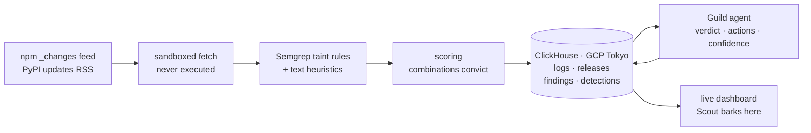

# Beagle Brigade

**Scout sniffs every new npm and PyPI release for malware, in real time.**

Attackers have pushed malware into npm and PyPI thousands of times in the past
year, and they did not break in: they published. A stolen maintainer token
becomes a new version of a package you already depend on, and it executes on
every laptop and CI runner that installs it, before anyone opens a file.
Beagle Brigade watches both registries continuously, pulls each new release
into a sandbox within seconds of publication, analyses it with Semgrep
dataflow rules without ever executing it, scores it, and hands anything
suspicious to an AI agent that returns a verdict an on-call engineer can act
on in under a minute.

Everything here is defensive. It watches public registries for malicious
uploads, it is not pointed at anyone, and it never runs what it downloads.


📺 **Demo video:** _YOUTUBE_LINK_HERE_ &nbsp;·&nbsp; built by
[`demo/`](demo) (narration + screen capture, timed automatically)

---

## By the numbers

| | |
|---|---|
| Real npm and PyPI releases scanned live during the hackathon | **184** |
| Real releases Scout barked at (scored malicious) | **0** |
| Real releases flagged for a human look | **1** (an oversized archive) |
| Inert malware fixtures caught | **4 of 4**, each scoring 100 |
| Honest native-build control | scores **13**, stays clean |
| Real npm registry events in ClickHouse | **9.5M**, aggregated in under a second |
| Semgrep findings in the AI-written repo | **12 → 0** |

Precision is the point. A scanner that barks at real packages gets switched
off on day one.

---

## Sponsors at a glance

| Sponsor | How we used it | The headline |
|---|---|---|
| **ClickHouse** | The entire data layer: live scan results plus replicated registry history | **9.5M** real npm change events, loaded at ~49k rows/sec, full-table aggregates in **under a second**, dashboard counters in **single-digit ms** |
| **Semgrep** | The detection engine (custom taint rules for install-time malware), plus **Semgrep Guardian** watching the AI that wrote this repo | **13** passing rule tests, **3 false-positive classes** fixed (`swarph-cli` 100 → 0), and Guardian caught **Trojan Source characters the AI wrote into our own Trojan Source detector** |
| **Guild.ai** | Hosts the triage agent that turns a score into a decision | Agent published via Guild's API, returns verdict + actions + confidence, and correctly calls our own false positives benign |

Not a sponsor: **ElevenLabs**, used only to narrate the demo video.

---

## How it works



1. **Tail the registries.** npm's replication `_changes` feed by sequence
   number, PyPI's updates RSS. New releases surface within seconds.
2. **Fetch into a sandbox.** Download the tarball or wheel, extract under a
   strict size/count/path budget, never run a line of it.
3. **Analyse.** Semgrep dataflow rules, plus cheap heuristics for things
   Semgrep is a poor fit for (entropy blobs, bidi Unicode, minified bundles).
4. **Score.** Combinations convict; single rules do not.
5. **Store.** Every release, finding and detection lands in ClickHouse.
6. **Triage.** Each detection wakes the Guild agent, which writes the
   judgement back onto the detection row.
7. **Show.** Live dashboard. Scout switches to his alert pose on a bark.

---

## ClickHouse

ClickHouse is not a log sink bolted on at the end; it is the only datastore in
the project. Schema in [`scanner/schema.sql`](scanner/schema.sql).

**Scale.** Beyond live scan results we replicated **9,513,792 real npm
registry change events** straight from npm's replication feed, loaded by
[`backfill.py`](scanner/beagle/backfill.py) with parallel workers walking
disjoint slices of the sequence space at roughly **49,000 rows/sec**. This is
real registry history, not synthetic filler: it backs publisher-cadence
baselines and the takedown queries.

**Latency.** The dashboard reports ClickHouse's own server-side timing, not a
stopwatch around `fetch()`. Counter queries land in single-digit milliseconds;
a `uniqExact` over the whole 9.5M-row history table runs in well under a
second. The query panel on the dashboard runs five preset analyst queries
live, showing the SQL, the rows scanned and the elapsed time.

**Shape.** Table names and the signals/alerts split follow RunReveal's model
(`logs`, `releases`, `findings`, `detections`, with `signals` and `alerts` as
views split on whether a notification fired), so the layout reads as familiar
to the ClickHouse team. That is a compatible schema, not an integration.

**Insights drive action.** A detection row is what wakes the Guild agent, and
the agent writes its verdict back into the same table that the dashboard
renders.

---

## Semgrep

Semgrep is the detection engine. Rules live in [`rules/`](rules) with their
test fixtures in [`rules/tests/`](rules/tests).

```bash
semgrep --test --config rules/ rules/tests/     # 13/13 passing
```

### What the rules do that grep cannot

They are taint-mode rules: they fire when data actually *flows* from a source
to a sink through assignments and sanitizers, not when two strings happen to
share a file. A credential file read reaching an outbound request is a finding;
the same two lines with nothing connecting them is not.

### Install-time execution is the hinge

Code in a `preinstall`/`install`/`postinstall` hook or a `setup.py` command
class runs on every machine that installs the package. The same code in a
library function someone must deliberately call is far less serious. Rules
that only matter at install time carry `install_context: true`, and the
scanner **discards them entirely** unless they land in a file that genuinely
runs during installation, resolved from `package.json` scripts or `setup.py`.
Before that gate existed, scanning `express` produced dozens of hits.

### Combinations convict

`child_process.exec` appears in thousands of honest build scripts. So
install-time rules carry deliberately low weights and the score comes from
combination bonuses in [`score.py`](scanner/beagle/score.py): install-time
execution **plus** credential access, or obfuscation **plus** a loader.

The negative control proves it. `fixtures/npm-benign-native-build` runs
`node-gyp rebuild` from a postinstall hook, exactly like thousands of real
packages, and scores **13**. The four malware fixtures score **100**.

### The hard part was not crying wolf

Naive rules flag almost everything in a real registry. Three false-positive
classes we found against live traffic and fixed, each now with a negative
control in the test suite:

| What fired | Why it was wrong | Fix |
|---|---|---|
| Every well-behaved API client | Reading a token from the environment and sending it in an `Authorization` header is the *correct* way to use an API key | Split credential **files** (never legitimate) from **environment** variables (only suspicious at install time), and excluded the auth-header shape |
| A package that strips a BOM | The invisible-Unicode heuristic matched `text.replace(/^\ufeff/, "")` | Narrowed to bidi override/isolate characters, which have no honest use in source |
| A Bearer-token parser | `$CP.exec(...)` also matches `RegExp.prototype.exec`, so `/^Bearer\s+(.+)$/i.exec(header)` read as a second-stage loader | Constrained the receiver by name |

Measured on real packages, before and after:

| Package | Before | After |
|---|---|---|
| `swarph-cli` | 100 | **0** |
| `breakaway` | 100 | **16** |
| `@paperclipai/plugin-cloudflare-sandbox` | 45 | **8** |
| malware fixtures | 100 | **100** |

### An honest limitation

The **OSS Semgrep engine is intraprocedural**: taint crossing a function
boundary needs Pro Engine. Rather than quietly claim coverage we do not have,
that case is recorded as a `todoruleid` in
[`rules/tests/exfiltration.js`](rules/tests/exfiltration.js), so it shows up
on every test run.

### Semgrep Guardian: the AI-generated code got scanned too

Every line in this repository was written by an AI coding agent (Claude
Code). So we pointed Semgrep at its output as well: **Semgrep Guardian** ran
inside the agent session, scanning each file as it was written, and we swept
the whole repo with Semgrep's registry rulesets. Twelve findings, every one in
AI-written code. The full write-up is in
[`docs/semgrep-guardian-finding.md`](docs/semgrep-guardian-finding.md).


**The finding: Trojan Source characters inside our Trojan Source detector.**
To catch the CVE-2021-42574 attack (bidirectional control characters that
make code read differently to a human than to the parser), the agent wrote a
detection regex... by pasting the raw, invisible U+202A–U+202E and
U+2066–U+2069 characters directly into
[`scan.py`](scanner/beagle/scan.py). The line rendered as an innocent-looking
`[-]` in every editor and diff. Semgrep's
`contains-bidirectional-characters` rule flagged it. The same session had also
left stray U+FEFF characters in the README and the slide deck.

It is exactly the class of bug the code was written to find, introduced by
the code-writing agent, invisible in review, and caught only by a tool that
reads bytes rather than glyphs.

**It happened three times, and the cause is systematic.** While writing up
the fix, the agent put the same raw characters back into this README, and
then again into the write-up. The agent edits files through tool calls whose
arguments are JSON, and JSON decodes a backslash-u escape into the character
itself. So every time the agent typed the *safe* escaped form, the file
received the invisible character. An agent writing files this way cannot
reliably type a Unicode escape, and nobody can see that it failed.
[`scripts/check_invisible.py`](scripts/check_invisible.py) now sweeps for it. Fixed by rewriting every one as an ASCII
escape (`r"[\u202a-\u202e\u2066-\u2069]"`). The detector still catches real
Trojan Source and still ignores honest BOM handling, verified after the fix.

What else the sweep turned up, all fixed or explicitly triaged:

| Finding | Verdict | Action |
|---|---|---|
| Bidi and BOM characters in `scan.py`, `README.md`, `slides.html` | **Real** | Rewritten as ASCII escapes |
| ClickHouse password sent in the URL query string, in both the Python and web clients (found by review during the same pass) | **Real**: query strings land in proxy and access logs | Moved to `X-ClickHouse-User` / `X-ClickHouse-Key` headers |
| f-string table names in `INSERT` / `TRUNCATE` | **Real but internal** | Every identifier is checked by `identifier()` against a strict pattern; `releases; DROP TABLE logs` is rejected |
| `sqlalchemy-execute-raw-query` | False positive: no SQLAlchemy here, values are bound as ClickHouse parameters | `nosemgrep` with the reason inline |
| Playwright `goto` / `evaluate` injection in demo tooling | Env-driven URL was a real gap; the rest were constant inputs | URL now locked to localhost; the rest annotated with reasons |

Result: **12 findings → 0**, rule tests still 13/13.

---

## Guild.ai

A detection is evidence, not a decision. The score says *something fired*; an
engineer still has to decide whether to wake anyone and what to rotate.

The triage agent runs **on Guild**, created and published through Guild's REST
API and installed into a workspace. Its prompt is
[`agent/PROMPT.md`](agent/PROMPT.md). The scanner starts a Guild session with
the detection and its evidence,
[`guild.py`](scanner/beagle/guild.py) polls for the reply, parses the four
sections and writes them back onto the ClickHouse detection row, which is what
the dashboard renders.

Real output, on our typosquat fixture:

> **VERDICT** `MALICIOUS`: a typosquat of the popular `express` library that
> steals SSH private keys during installation.
>
> **WHY** `bb-meta-install-hook` in `package.json` triggers a postinstall
> script… `bb-js-recon-sensitive-paths` (line 16) reads the private SSH key
> from the home directory… line 18 transmits it via an outbound HTTPS POST.
>
> **ACTIONS** Remove the dependency · search internal lockfiles · rotate SSH
> private keys on any machine that installed it · report to the registry.
>
> **CONFIDENCE** `HIGH`: the code explicitly and unconditionally exfiltrates
> a private key at install time.

Just as important, it **declines to cry wolf**. Handed our own
false positives it returned `LIKELY BENIGN` with the reason, which is exactly
the behaviour that keeps a scanner switched on.

The prompt also forbids naming or blaming a maintainer: a compromised
publishing token is far more common than a malicious maintainer, and the
account owner is usually the first victim.

---

## Running it

Prerequisites: Python 3.11+ with [uv](https://docs.astral.sh/uv/), Node 20+
with pnpm, Semgrep (`uv tool install semgrep`).

```bash
cp .env.example .env            # ClickHouse + Guild credentials

cd scanner
uv sync
uv run beagle init-db                      # apply schema.sql
uv run beagle replay                       # scan local fixtures (deterministic)
uv run beagle live --duration 600          # tail npm + PyPI for real
uv run beagle backfill --target 5000000    # bulk-load registry history
uv run beagle triage                       # hand detections to the Guild agent
uv run beagle stats

cd ../web && pnpm install && pnpm dev      # http://localhost:3100
```

---

## Ground rules

These are enforced in code, not just stated here.

- **Nothing downloaded is ever executed.** Archives are read as bytes and
  extracted under a size/count/path budget. Extraction rejects path traversal,
  absolute paths, symlinks and device entries, and bounds total uncompressed
  size against decompression bombs. See [`fetch.py`](scanner/beagle/fetch.py).
- **A human confirms before anything is called malicious in public.** The
  scanner produces evidence, the agent produces a judgement, neither publishes
  an accusation.
- **No maintainer is named or blamed.** Everything routes to the registry's
  security team.
- **Fixtures are inert.** Test inputs in
  [`scanner/fixtures/`](scanner/fixtures) target `.invalid` hosts that cannot
  resolve, carry no payload, and are never published anywhere.

## Layout

| Path | What |
|---|---|
| `rules/` | Semgrep rules and their test fixtures |
| `scanner/` | Python pipeline: feeds, fetch, scan, score, store, Guild triage |
| `scanner/fixtures/` | Inert detection fixtures, including the negative control |
| `web/` | Next.js dashboard |
| `agent/` | The Guild triage agent's prompt |
| `demo/` | Narration, screen recording and video build |
| `slides.html` | Four-slide pitch deck |
| `brand/` | Scout |
